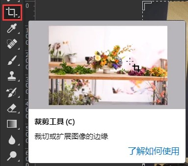
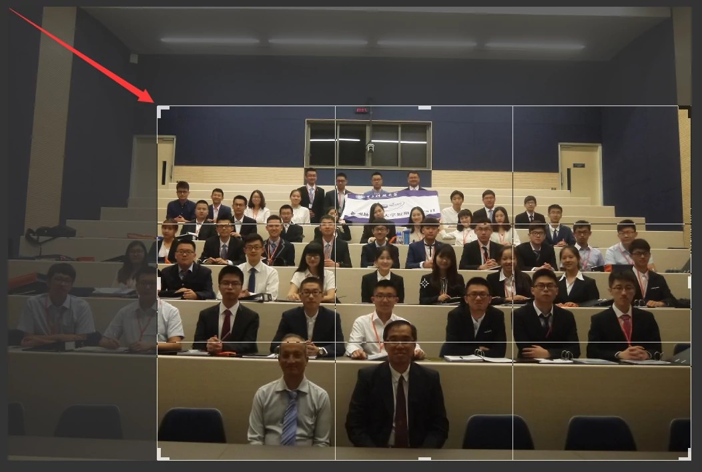
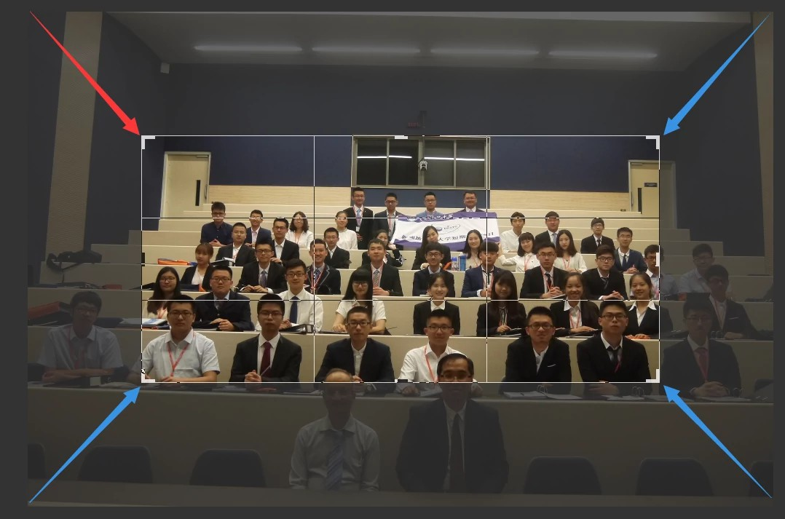
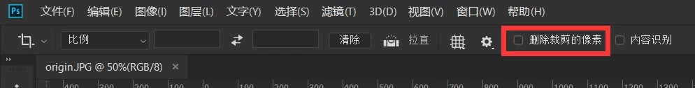
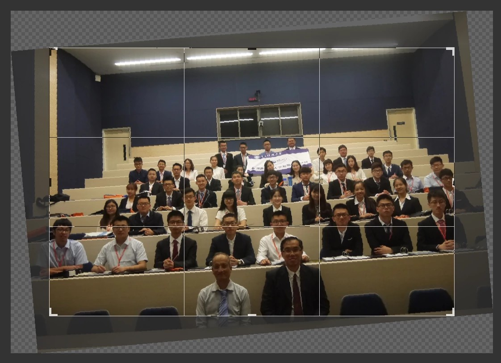
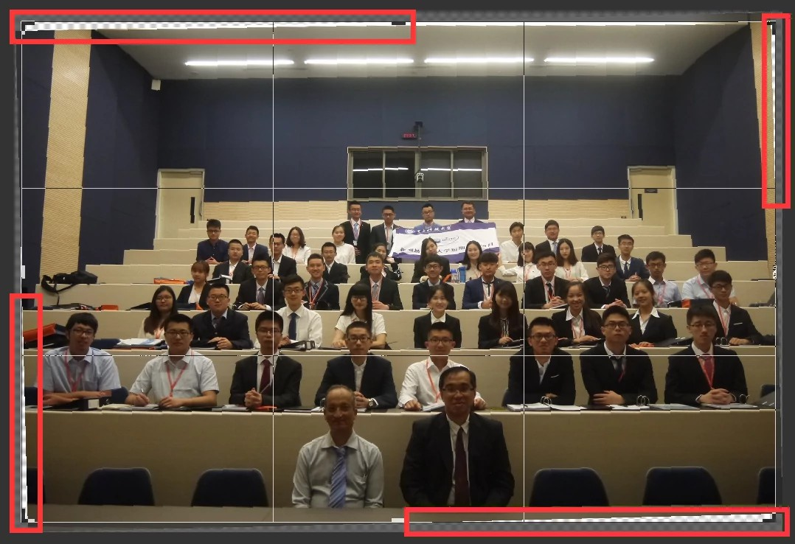
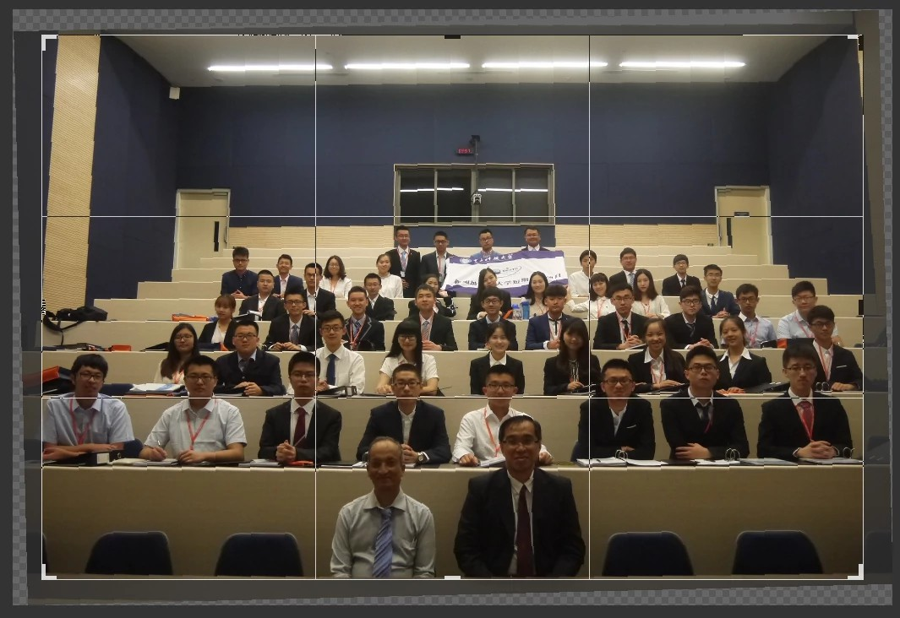
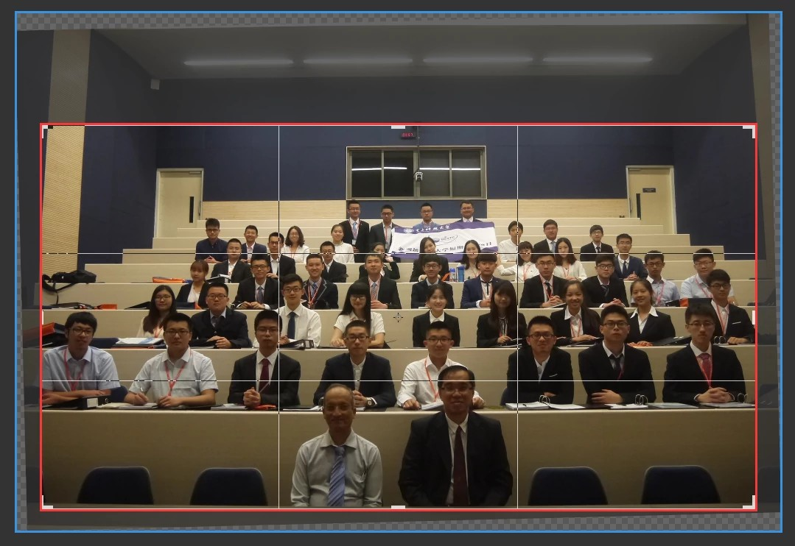
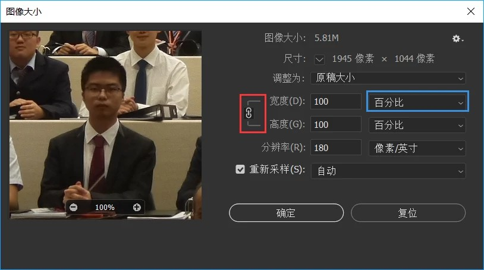
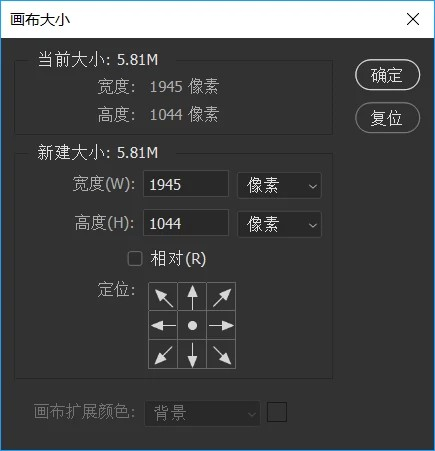

# PS 入门教程 1：裁剪与旋转

> 欢迎来到元卅 PS 入门教程。PS（Photoshop）是 Adobe 公司出品的，最强大、最通用的图像处理软件。
>
> 本篇为全教程的第一章，配套对应视频教程。为您讲述图片裁剪、旋转、保存和缩放。
>
> 配套视频教程：[Bilibili](https://www.bilibili.com/video/BV13W411r7Ae) [YouTube](https://www.youtube.com/watch?v=CYAL3Ubf4EE)。官网文字讲义：[元卅馆](http://yuansasi.com/pc/reader.html?p=7)

## 图片裁剪

要想将图片的一部分裁剪掉，可以使用“裁剪工具”。

进入裁剪工具后，图像周围会出现八个控制柄（四边和四角各一个）。拖动这些控制柄可以控制裁剪之后的区域。

设置好裁剪区域以后，拖动角上的控制柄时，按住 Shift 键可以锁定长宽比地缩放裁剪框；而按住 Alt 键可以控制“以中心为原点收缩”，即对称收缩。自然同时按住 Shift 和 Alt 键即可朝中心等比收缩。

**注意** 进入“裁剪工具”后在设置栏将“删除裁剪的像素”选项取消勾选，则会在画面之外保留被裁掉的区域。这部分数据无法存入\*.jpg 格式文件。

## 图片旋转

要想将图片旋转一定角度，同样使用“裁剪工具”。

进入裁剪工具后，将鼠标移动到控制柄外侧一段距离，到光标变为双向弯箭头时，拖拽鼠标即可完成旋转。

当图片中有水平或竖直参考线时，可以在“裁剪工具”中按住 Ctrl 键拖拽描出这条参考线，Photoshop 会自动将图片旋转到使此参考线水平或竖直的角度。叫做“拉直”。

拉直不会自动调整裁剪区域大小，故在矩形四角会产生空白区域。

此时我们应该按住 Shift+Alt 键裁剪掉四个角的空白区域。

## 保存文件

在菜单栏“文件”→“存储”选项中保存图片（快捷键 Ctrl+S）。若当前图像包含原格式无法存储的数据则无法保存，而改用\*.psd 格式保存。

例如*.jpg 格式无法存储画布外信息、图层信息、透明度等。若当前图像包含这些数据，将自动以*.psd 格式存储。

\*.jpg 格式是可压缩图像格式，存储时可以选择图像品质。更高的图像品质意味着更好的图像质量和更大的文件体积。

**注意**

-   \*.png 格式可以存储透明信息，\*.gif 格式可以存储动画序列（动图），\*.webp 格式是优秀的新型网络传输格式
-   \*.psd 格式体积上限为 2GB，文件体积大于 2GB 时要改用\*.psb 格式存储。

## 图像缩放（图像大小）

在菜单栏“编辑”→“图像大小”中修改图像大小。

默认锁定长宽比，即宽度和高度等比例缩放。若要独立控制宽度或高度，要点宽度、高度参数左侧的锁链标志解锁。

建议始终保持锁定长宽比，以避免图像失真。

## 画布大小

在菜单栏“编辑”→“画布大小”中修改画布大小。

画布即图像的可见区域，“裁剪工具”实质上就是在裁剪画布大小。

在对尺寸有要求的作业中编辑画布大小非常有用。例如做一张一寸照片，就要调整画布大小到标准一寸照片尺寸(25㎜×35㎜)，在该区域内调整图像。

