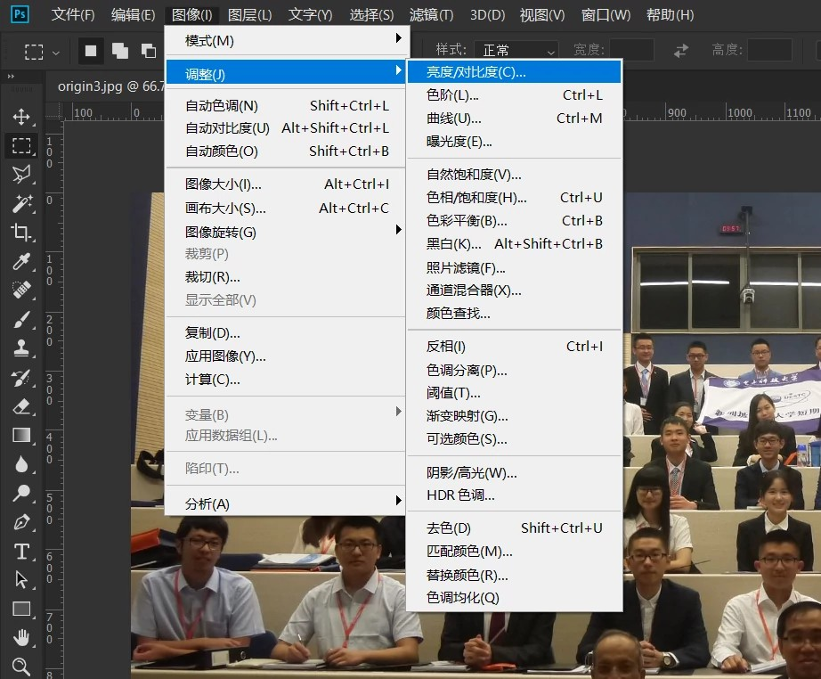
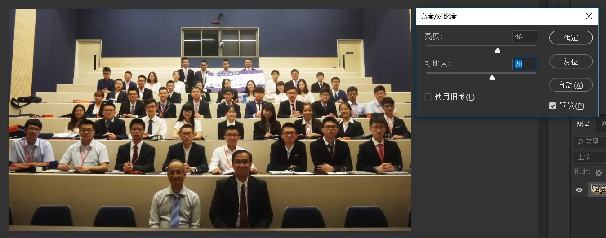
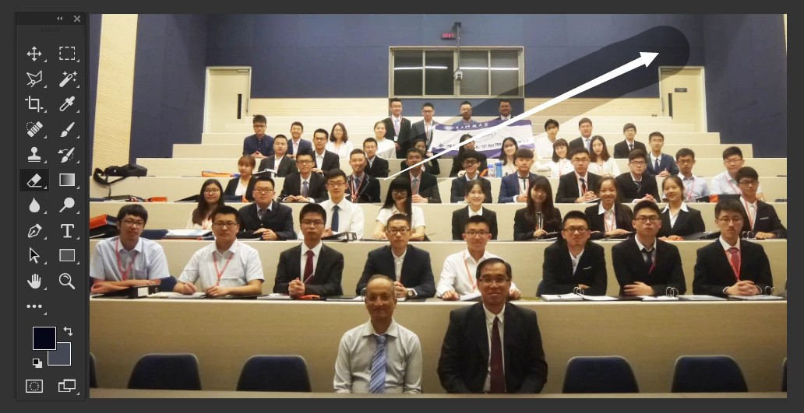
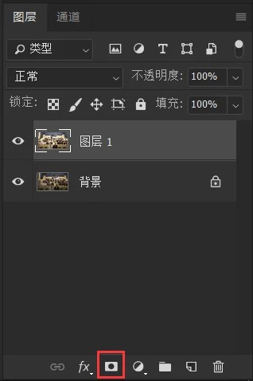
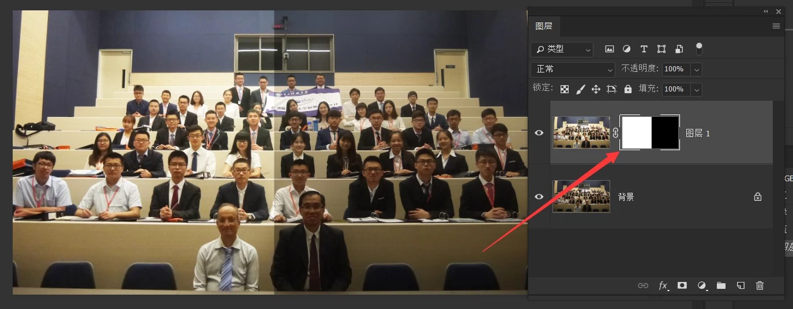
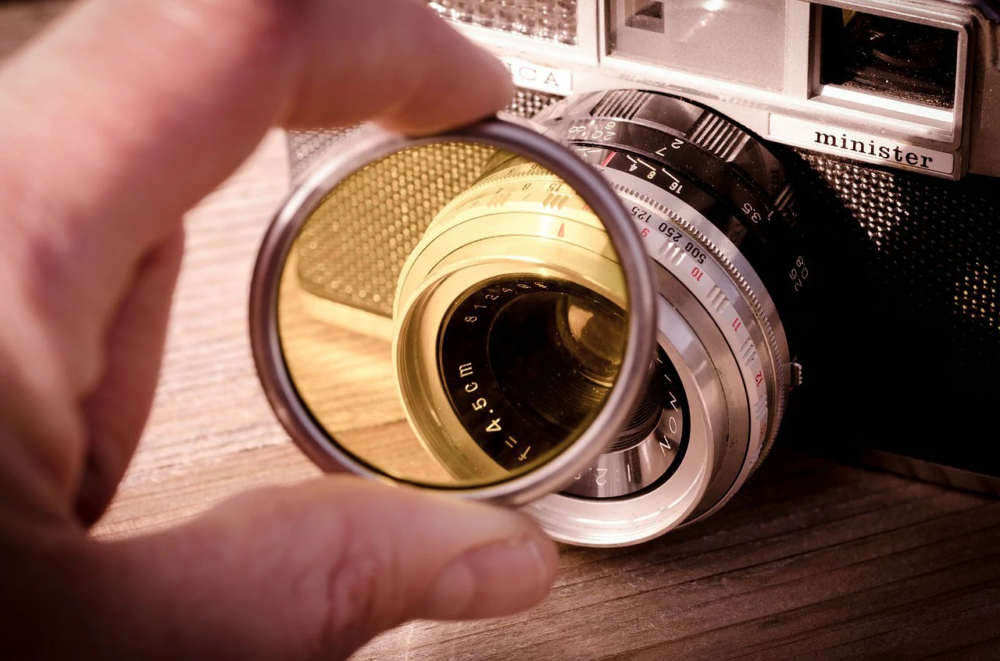
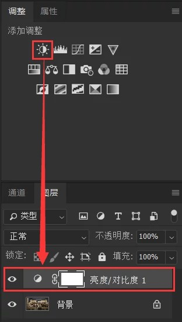

# PS 入门教程 2：图像美化

> 欢迎来到元卅 PS 入门教程。PS（Photoshop）是 Adobe 公司出品的，最强大、最通用的图像处理软件。
>
> 本篇为全教程的第二章，配套对应视频教程。本文介绍了图层、蒙版和调整图层的基础知识，以及如何利用他们提升图片质量。
>
> 配套视频教程：[Bilibili](https://www.bilibili.com/video/BV1st411h7Ks) [YouTube](https://www.youtube.com/watch?v=hA29fZbcwAM&t=254s)。官网文字讲义：[元卅馆](http://yuansasi.com/pc/reader.html?p=8)

## 直接调整原图

打开图片后，在菜单栏“图像”→“编辑”中找到需要调整的项目，设定参数后确定即可。

以上调整方式有一个缺点，就是只能全图修改而不能局部控制。例如一张照片有一部分太暗，我们全图调亮后，之前的亮部会过曝。如果能只调整有缺陷的部分就好了。接下来我们来解决这个问题。

## 复制图层调整

### 什么是图层？

图层顾名思义就是“图像的层”，可以形象理解为透明塑料板。每个层可以独立控制，层与层之间不会相互影响。

引入图层的概念后，很多工作都会很轻松。例如 FaceQ，成千上万种不同的头像不需要依次制作，而只需要做出不同的脸型、五官、头发等部件，再拼接起来即可。上述每一种部件都对应一个图层。

### 如何使用图层修图？

选中原图层，按 Ctrl+J 复制一个图层。对复制的图层在菜单栏“图像”→“编辑”中应用需要调整的项目，将希望调整的部分调整到满意。

现在我们有一个缺陷部分调整好的图层，但是有一些不想调整的部分也被调整了。这时我们可以使用橡皮擦工具，将不希望调整的部分擦掉，露出下面未经调整的原图层即可。

## 使用"蒙版"调整

使用上述复制图层后擦掉不希望部分的方法同样有缺点，就是擦掉的部分不能还原。为了解决这个问题，我们要引入蒙版的概念。

### 什么是蒙版？

蒙版用来控制图层的局部可见性，即局部透明度。在图层面板选中一个图层，点击面板底端的蒙版按钮即可为当前图层打蒙版。

在蒙版上用画笔绘制即可控制对应位置的可见性。黑色是完全不可见（全透明），白色是完全可见（全不透明），介于二者之间的灰色则为不同程度的半透明。

### 如何使用蒙版修图？

同之前所说，复制一个图层应用调整，之后对复制的图层打蒙版。在蒙版上将不需要调整的部分涂黑即可。

### 有什么区别？

如果擦掉调整后的图层的话，被擦掉的部分无法还原。但通过蒙版控制的话，被隐藏的部分可以通过在蒙版上涂白恢复。

## 使用“调整图层”

但上述调整方式也有缺陷：无法动态调整。如果之前将图像调为偏蓝，现在又想调为偏紫，则要重新调整。

而且如上蒙版也不够简洁：我只需要调整亮度，却需要复制一遍原图，导致文件体积没有必要地增大。

为了解决以上问题，我们需要引入“调整图层”的概念。

### 什么是调整图层？

调整图层是一类特殊的图层，十分类似滤镜，可以对其下的所有图层（或其下的一个图层）施加调整效果。

类比滤镜：透过红色滤镜我们看到的任何图像都是红色的，而透过绿色滤镜我们看到的任何图像都是绿色的。同样的，透过一个“提升亮度”的调整图层，下面的任何图像都会变亮。

### 如何使用调整图层？

选中要在其上插入调整图层的图层，在“调整”面板中选择要添加调整图层的类型即可。

在“调整”面板中，我们可以看到有很多类型可供选择：亮度/对比度、自然饱和度、色彩平衡等。这些都相当于特殊的滤镜，对透过他的光线进行调整。

选中调整图层上的小图标时，可以在“属性”面板调整该调整图层的参数。

创建调整图层后，PS 会自动帮我们为其打蒙版。我们可以像之前操作普通图层的蒙版一样操作调整图层的蒙版。

### 有什么优点？

-   参数动态调整：可以在属性面板；
-   压缩文件体积：没有冗余的重复图像信息；
-   滤镜可复用：将调整图层复制到其他文件中依然可用。

## 后记

了解以上基础知识之后，我们就可以动手修图了。找到图片的问题，调整相应参数即可。
